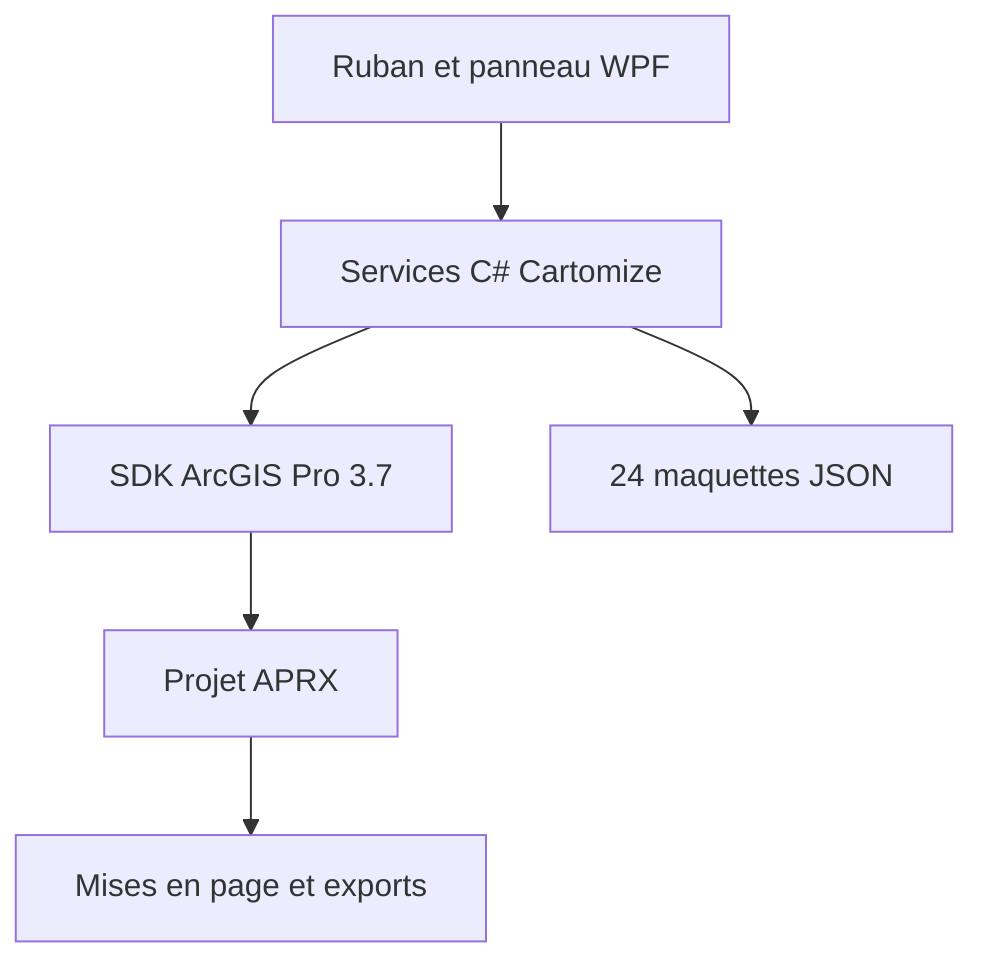

# Architecture technique

## Choix principal

L'add-in Cartomize utilise l'architecture native prévue par Esri :

- C#/WPF et `Config.daml` gèrent le ruban, le panneau latéral et l'expérience ArcGIS Pro ;
- `ArcGIS.Core.Data`, `ArcGIS.Core.Geometry` et `ArcGIS.Core.Data.Raster`
  profilent les couches et les pixels ;
- `ArcGIS.Desktop.Mapping` produit les rendus, coloriseurs et mises en page ;
- les 24 maquettes restent des JSON déclaratifs, sans code exécutable ;
- les sorties restent natives et éditables dans ArcGIS Pro.

La boîte `Cartomize.pyt` est conservée comme outil ArcPy autonome et comme
référence de parité, mais le panneau compilé ne l'exécute pas.

## Flux

## Répartition des responsabilités

| Composant | Responsabilité |
| --- | --- |
| `src/Cartomize.ArcGISPro` | UI, commandes et moteurs natifs SDK : audit, couches, raster, symbologie, mises en page, production et MapOps |
| `toolbox/Cartomize.pyt` | boîte ArcPy autonome et référence fonctionnelle, non requise par l'add-in |
| `toolbox/cartomize_core` | port ArcPy autonome des règles QGIS 10.5.1 |
| `templates_library` | catalogue hors ligne validé de 24 maquettes |
| `tests` | tests purs ne nécessitant pas ArcGIS Pro |
| `scripts` | validation statique et compilation Windows |

## Non-destruction

- l'audit et les diagnostics sont en lecture seule ;
- la symbologie modifie le rendu de la couche, pas ses entités ou pixels ;
- chaque mise en page reçoit un nom unique ;
- la suppression d'un fond de carte concerne seulement l'élément de légende via `LegendElement.removeItem()` ;
- les recettes et rapports sont écrits de façon transactionnelle avec un fichier temporaire.

## Correspondances natives

- PyQGIS devient le SDK .NET ArcGIS Pro pour l’add-in compilé ;
- QPT devient PAGX, format natif réutilisable d’ArcGIS Pro ;
- les styles QGIS deviennent des renderers, colorizers et éléments de style ArcGIS Pro ;
- les règles de `vector_intelligence`, `raster_sampling`,
  `raster_intelligence_core` et `raster_themes` sont transposées en C# et
  alimentées par `Feature`, `Geometry`, `PixelBlock` et les coloriseurs Esri.

## Dépendances

- ArcGIS Pro 3.7 ;
- .NET 10 et `Esri.ArcGISPro.Extensions30` 3.7.0.1901 pour l'interface compilée ;
- aucune dépendance Python ou `pip` pour l'add-in compilé.
