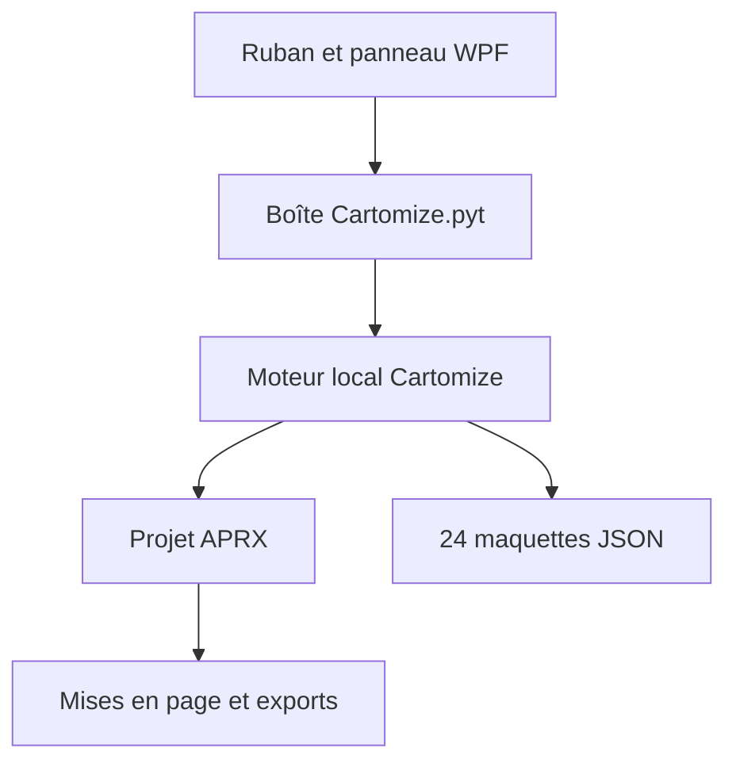

# Architecture technique

## Choix principal

Cartomize utilise une architecture hybride prévue par Esri :

- C#/WPF et `Config.daml` gèrent le ruban, le panneau latéral et l'expérience ArcGIS Pro ;
- la boîte Python `Cartomize.pyt` expose les analyses et automatisations dans le Géotraitement ;
- `arcpy.mp` produit les objets de carte et de mise en page ;
- les 24 maquettes restent des JSON déclaratifs, sans code exécutable ;
- les sorties restent natives et éditables dans ArcGIS Pro.

## Flux

## Répartition des responsabilités

| Composant | Responsabilité |
| --- | --- |
| `src/Cartomize.ArcGISPro` | UI, commandes, intégration du ruban, ouverture des outils |
| `toolbox/Cartomize.pyt` | paramètres Esri, orchestration et messages de Géotraitement |
| `toolbox/cartomize_core` | audit, moteurs vectoriel/raster, relations, piles de couches, mise en page, symbologie, recettes, production, validation et MapOps |
| `templates_library` | catalogue hors ligne validé de 24 maquettes |
| `tests` | tests purs ne nécessitant pas ArcGIS Pro |
| `scripts` | validation statique et compilation Windows |

## Non-destruction

- l'audit et les diagnostics sont en lecture seule ;
- la symbologie modifie le rendu de la couche, pas ses entités ou pixels ;
- chaque mise en page reçoit un nom unique ;
- la suppression d'un fond de carte concerne seulement l'élément de légende via `LegendElement.removeItem()` ;
- les recettes et rapports sont écrits de façon transactionnelle avec un fichier temporaire.

## Correspondances natives

- PyQGIS devient ArcPy pour l’accès aux couches et `arcpy.mp` pour la mise en page ;
- QPT devient PAGX, format natif réutilisable d’ArcGIS Pro ;
- les styles QGIS deviennent des renderers, colorizers et éléments de style ArcGIS Pro ;
- les modules purs `raster_intelligence_core`, `raster_sampling`,
  `band_semantics`, `raster_themes` et `layer_stack` sont partagés sans
  modification avec le ZIP QGIS 10.5.1.

## Dépendances

- ArcGIS Pro 3.7 ;
- environnement Python `arcgispro-py3` livré avec ArcGIS Pro ;
- .NET 10 et `Esri.ArcGISPro.Extensions30` 3.7.0.1901 pour l'interface compilée ;
- aucune dépendance `pip` supplémentaire.
